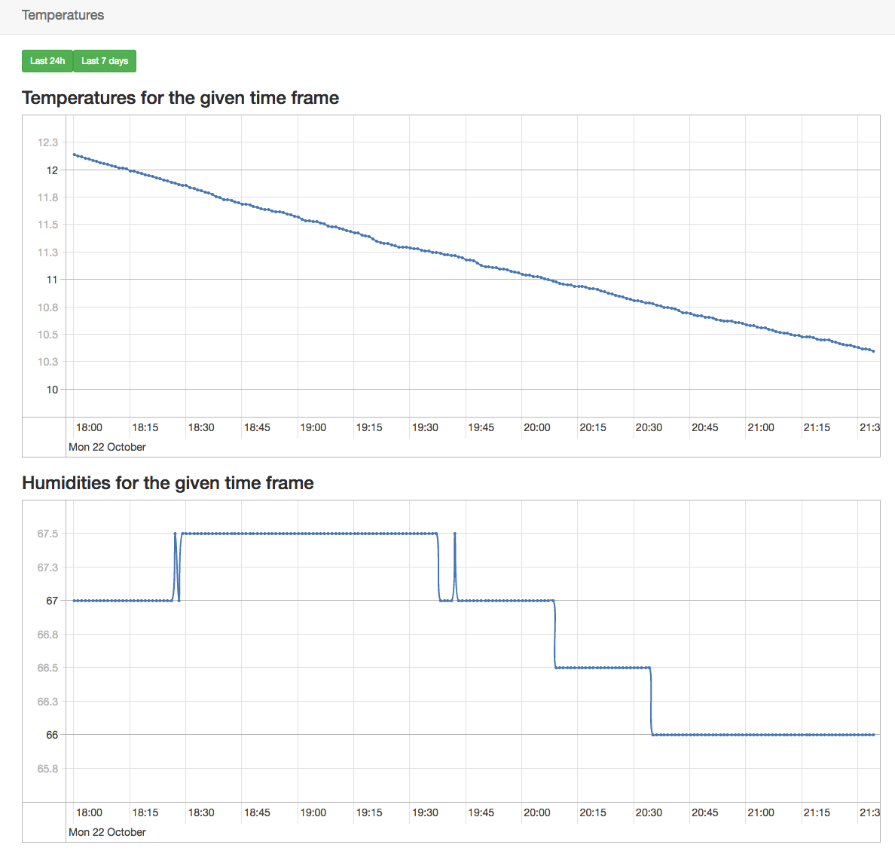

# Balcony information system

A (useless but fun) hobby project to see how Raspberry Pi's Sense Hat, RuuviTag and Google Cloud will work.

The project consist of three components, `client`, `server` and `frontend`.

## Client

Client is a NodeJS project made for Raspbian and RuuviTag. It fetches the newest information about the temperature and humidity from the given RuuviTag sensor. The results are cached locally and sent to the backend when the time comes.

## Server

The server is a glue-y compilation of:
- Google Cloud Function for an endpoint
- Google SQL PostgreSQL instance for storage
- Google KMS for secret management

## Frontend

Google App Engine node.js project to display the stored values.

Yeah the frontend needs still some work ;)

